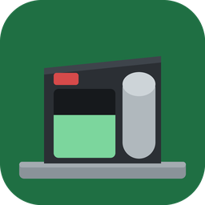

# Groningen container vulgraad

A Home Assistant integration that shows how full an underground waste container
in Groningen is.

<br clear="left">

The municipality publishes container fill levels only inside a web portal that
has no public API for them. This integration reads that portal for you and
turns your containers into ordinary Home Assistant sensors.

No address or container number is stored in this repository. Both are entered
in the integration's own setup screen.

## Installation

### With HACS (recommended)

[HACS](https://hacs.xyz) is the Home Assistant Community Store. It installs
this integration for you and tells you when a new version is released, which is
why it is the preferred route.

1. Install HACS first if you do not have it yet, by following the guide at
   [hacs.xyz](https://hacs.xyz/docs/use/download/download/).
2. In Home Assistant, open **HACS** from the sidebar.
3. Open the menu at the top right, the one with three dots, and choose
   **Custom repositories**.
4. Paste `https://github.com/WouterJN/homeassistant-groningen-vulgraad` into the
   repository field, set **Type** to **Integration**, and select **Add**.
5. Search HACS for **Groningen container vulgraad**, open it, and select
   **Download**.
6. Restart Home Assistant.

Once this integration is listed in the HACS default store, steps 3 and 4 will
no longer be needed.

### By hand

Copy the folder `custom_components/groningen_vulgraad/` into the
`custom_components/` folder of your Home Assistant configuration, then restart
Home Assistant. You will have to repeat this for every update, which is what
HACS saves you from.

## Setting it up

1. Go to **Settings**, then **Devices and Services**, then **Add Integration**,
   and search for **Groningen container vulgraad**.
2. Enter any Groningen postcode and house number. It only unlocks the portal
   and filters nothing, so it need not be your own. A public building is fine.
3. Pick your containers from a dropdown of the roughly 1650 real containers
   that have a fill sensor, sorted by distance from your Home Assistant
   location, closest first.
4. Set the poll interval. The default, and the friendly minimum, is one hour.

### Following more containers later

One entry holds as many containers as you like, so do not add the integration a
second time for the same address. Home Assistant will refuse that, because a
single poll already returns the whole municipality and a second entry would
only double the traffic.

Instead go to **Settings**, then **Devices and Services**, find **Groningen
container vulgraad**, and choose **Configure**. The container list is a
multiple choice field: add the ones you want and submit. A sensor appears for
each.

## What you get

One sensor per container, reported as a percentage with
`state_class: measurement`, grouped into a device per cluster. Each sensor
carries `warn_threshold`, `alarm_threshold`, `fraction` and `status` as
attributes, where status is `ok`, `warn` or `alarm`, so cards and automations
never hardcode 60 and 80.

A container whose fill sensor is absent, or a poll that fails, reports
`unavailable`. It never reports 0, which would read as "just emptied" and fire
exactly the automation you did not want.

One fetch serves every container you configure. The portal returns the whole
municipality or nothing, so watching ten containers costs what watching one
costs. That is also why polling more often than hourly is discouraged: the
portal rebuilds a large payload every time.

## Where the data comes from

Fill levels exist only inside the portal, so that is where they are read.

The municipality does publish an open data service for container locations,
clusters and fractions, at `maps.groningen.nl/geoserver`. This integration uses
it to keep the container picker readable when the portal cannot be reached. It
carries no fill level and no sensor flag, and it is slightly staler than the
portal, so it never replaces it.

## When the portal is rebuilt

Every call to the portal has to name an internal identifier that is generated
when the portal software is built. A rebuild changes all of them, which used to
break this integration until a new version shipped.

It now repairs itself. The portal serves its own page definitions over plain
anonymous requests, and each definition names the operation behind every widget
next to a description of what that operation does. So when the stored
identifiers stop working, the integration reads the new ones straight from the
portal and carries on, then remembers them. Which pages to read is not guessed
either: the portal names the next page at every step of the flow.

Recovery happens inside the poll that hit the problem, not on the next one, so
no reading is skipped and your sensors do not go unavailable. That poll takes
roughly a second longer than usual. Nothing hardcoded is left except the names
of things in the portal's data model, which outlive any rebuild.

The repair notice in Home Assistant now only appears if that recovery also
fails, which would mean the portal changed more deeply than a rebuild.

## Icon

The artwork lives in `assets/`. It draws the container as it actually looks on
the street: the dark housing with its sloping roof, the stainless deposit drum,
the numbered label, and the tread plate it stands on. The bin itself is below
ground and never visible, so the fill level is shown as a gauge window in the
door.

`logo.svg` is the source, and `python assets/render_logo.py` regenerates the
PNG sizes from the same shapes, so no drawing program is needed.

Home Assistant does not read icons from an integration's own folder. To make
this one appear on the integration card, the PNG files have to be contributed
to the Home Assistant brands repository, under
`custom_integrations/groningen_vulgraad/`.

## Development

```bash
python -m venv .venv && .venv/bin/pip install -r requirements-dev.txt
.venv/bin/python -m pytest tests -q
```

`custom_components/groningen_vulgraad/api.py` imports nothing from Home
Assistant, so you can exercise it on its own.

## License

MIT, see [LICENSE](LICENSE).
